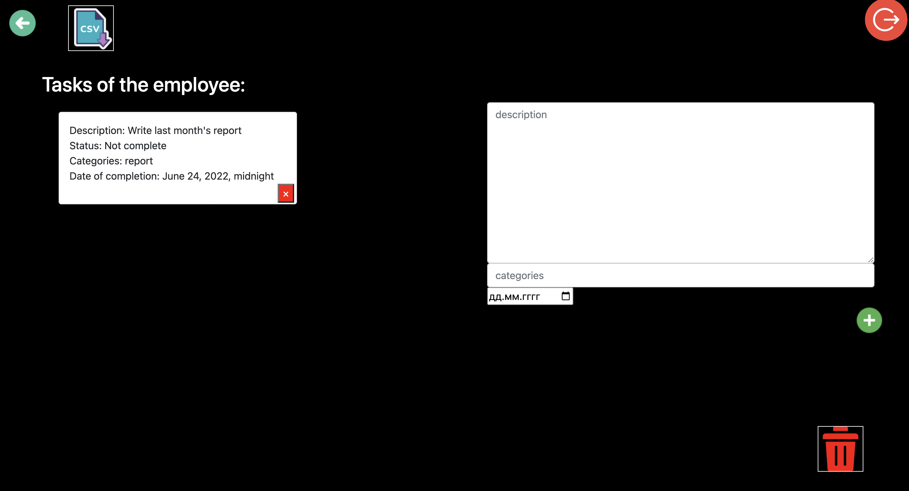

# Do_It

###### Here write description of the project

## How to run this application Do_It following commands:
- 'git clone https://github.com/JaryjDementor/Do_It.git'
- 'python -m venv .venv'
- 'source .venv/bin/activate'
- 'pip install -r requirements.txt'
- 'python manage.py runserver'

## About project

### It's an application that helps make working in a big company easier. Anyone can register and create their own team.

### On first page user can go to register or log in.

### When a user presses register it will redirect him to the registration page. 

### When a user presses log in it will redirect him to the log in page.

### After registration or login, the user is redirected to the 'User' page.

### On this site the user can:
- go to the create new team page: 

- view the tasks left by the user manager:

#### On this page user see tasks, can create a personal task and export job in csv file.

- open the rest api and see all employees and their tasks for today:

- join the team of your choice:

### On team page user cen:

- add an employee:

- delete team:

- go to employee page:

### When the session has ended, the user can log out on any page 

## Thank you for your time.

